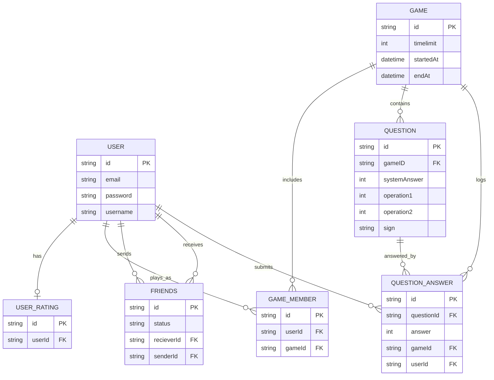

## MATH IO
a multiplayer web based game that checks your maths ability, play games win them score higher, climb up the rank mode
### Architecture Diagram

### Database Design

```mermaid
erDiagram
  USER ||--o| USER_RATING : has
  USER ||--o{ GAME_MEMBER : plays_as
  USER ||--o{ FRIENDS : sends
  USER ||--o{ FRIENDS : receives
  USER ||--o{ QUESTION_ANSWER : submits
  GAME ||--o{ GAME_MEMBER : includes
  GAME ||--o{ QUESTION : contains
  GAME ||--o{ QUESTION_ANSWER : logs
  QUESTION ||--o{ QUESTION_ANSWER : answered_by

  USER {
    string id PK
    string email
    string password
    string username
  }
  GAME {
    string id PK
    int timelimit
    datetime startedAt
    datetime endAt
  }
  USER_RATING {
    string id PK
    string userId FK
  }
  GAME_MEMBER {
    string id PK
    string userId FK
    string gameId FK
  }
  FRIENDS {
    string id PK
    string status
    string recieverId FK
    string senderId FK
  }
  QUESTION {
    string id PK
    string gameID FK
    int systemAnswer
    int operation1
    int operation2
    string sign
  }
  QUESTION_ANSWER {
    string id PK
    string questionId FK
    int answer
    string gameId FK
    string userId FK
  }
```